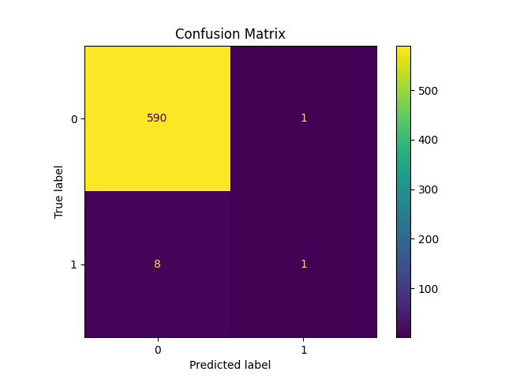

# Churn Prediction & Explainability

End-to-end churn prediction system built using behavioral and temporal subscription data.
This project demonstrates a full machine learning workflow — from data generation and feature engineering to model evaluation, explainability, and BI-ready deployment artifacts.

## 📌 Problem Statement

Customer churn directly impacts recurring revenue in subscription-based businesses.
The objective of this project is to:

- Predict which customers are likely to churn

- Identify key behavioral and temporal drivers

- Rank customers by churn probability

- Provide explainable insights for business stakeholders

- Export predictions for BI dashboarding

## 🧱 Project Architecture

```bash
Churn_Prediction_Explainability/
│
├── data/                  
│   └── subscription_usage_data.csv
│
├── models/                
│   └── logistic_regression.pkl
│
├── reports/               
│   ├── roc_curve.png
│   ├── confusion_matrix.png
│   └── shap_summary.png
│
├── powerbi/               
│   └── churn_predictions_for_powerbi.csv
│
├── notebooks/             
│   └── Churn_Prediction_End_to_End.ipynb
│
├── src/                   
│   ├── generate_data.py
│   └── train.py
│
├── README.md
└── requirements.txt
```

This structure mirrors a production-style ML project layout.

## 📊 Dataset Overview

Synthetic subscription dataset (5,000 customers) including behavioral and temporal signals.

### Behavioral Features

- usage_minutes_last_30d

- avg_sessions_per_week

- support_tickets_last_90d

- usage_trend_ratio

### Temporal Features

- tenure_months

- revenue_lifetime

- engagement_score

### Target Variable

- churn (1 = churned, 0 = retained)

The dataset is generated programmatically via:

src/generate_data.py

## ⚙️ Feature Engineering

To improve predictive performance and interpretability, several behavioral and temporal features were engineered:

- **Revenue Lifetime** = tenure × monthly charges  
  Captures cumulative customer value over time.

- **Engagement Score** = weighted combination of usage minutes and session frequency  
  Quantifies overall product interaction intensity.

- **Usage Trend Ratio**  
  Identifies declining engagement patterns that often precede churn.

- **Support Ticket Frequency (90-day window)**  
  Acts as a proxy for customer friction and dissatisfaction.

- **Behavioral Risk Signals**  
  Derived from combinations of low tenure, declining usage, and high support activity.

These engineered features strengthen model signal quality while preserving business interpretability, enabling both accurate churn prediction and explainable insights.

## 🤖 Modeling Approach

### Logistic Regression (Baseline Model)

- Interpretable probabilistic classifier

- Outputs churn probability per customer

- Suitable for risk ranking and segmentation

## 📈 Model Evaluation

Evaluation performed using:

- ROC-AUC score

- ROC Curve visualization

- Confusion Matrix

- Probability scoring for churn ranking

Generated artifacts:




ROC-AUC measures model discrimination ability between churn and non-churn.

## 🔎 Model Explainability

Explainability implemented using SHAP.

Purpose:

- Identify top churn-driving features

- Measure feature contribution impact

- Provide transparency for stakeholders

Output:

- reports/shap_summary.png

This allows business teams to understand:

- Which factors increase churn risk

- Which behaviors indicate retention

## 📊 Power BI Integration

The project exports:
```bash
powerbi/churn_predictions_for_powerbi.csv
```

This file includes:

- Customer features

- Actual churn label

- Predicted churn probability

You can build dashboards showing:

- High-risk customer segments

- Revenue at risk

- Churn probability distribution

- Feature impact insights

This bridges machine learning with business reporting.

## 🚀 How to Run

### 1️⃣ Install Dependencies

```bash
pip install -r requirements.txt
```

### 2️⃣ Generate Dataset

```bash
python src/generate_data.py
```

### 3️⃣ Train Model & Generate Artifacts

```bash
python src/train.py
```

This will:

- Train churn model

- Save trained model artifact

- Generate ROC curve

- Generate confusion matrix

- Export Power BI dataset

## 📓 Notebook Walkthrough

Open:
```bash
notebooks/
```

* The notebook contains:

* Business problem framing

* Exploratory Data Analysis

* Feature engineering

* Model training

* ROC-AUC comparison

* Explainability visualization

* Export steps

It provides a complete step-by-step narrative of the project.

## 🧠 Skills Demonstrated

- Behavioral feature engineering

- Temporal feature modeling

- Predictive modeling (Logistic Regression)

- Model evaluation (ROC-AUC, confusion matrix)

- Explainable AI (SHAP)

- Risk segmentation

- BI-ready data pipeline

- Modular ML project structure

## 🔮 Future Enhancements

- XGBoost implementation

- Hyperparameter tuning

- Cross-validation

- Threshold optimization

- Feature importance ranking

- Model deployment (FastAPI / Streamlit)

- Cloud deployment (AWS / Azure)

## 📌 Summary

This project demonstrates a complete churn analytics workflow — from synthetic subscription data generation to explainable machine learning predictions and BI-ready outputs.

It reflects real-world subscription and SaaS analytics use cases and follows a production-style project structure.
